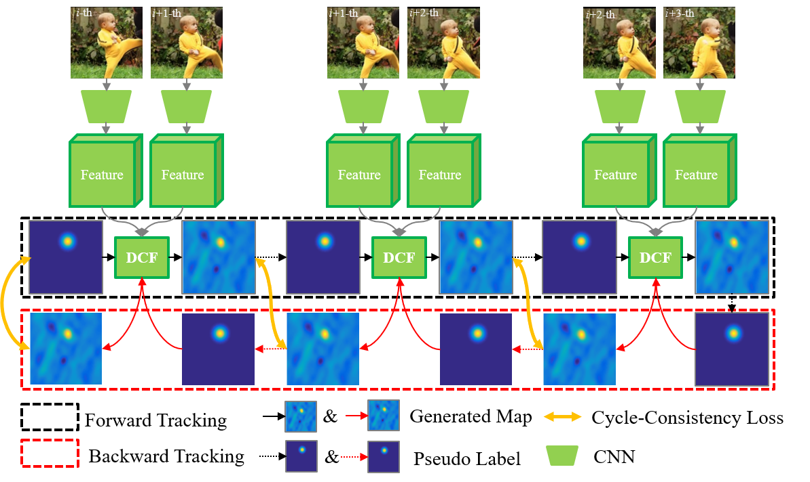

## **Self-supervised Deep Correlation Tracking**



## Abstract
The training of a feature extraction network typically requires abundant manually annotated training samples, making this a time-consuming and costly process. Accordingly, we propose an effective self-supervised learning-based tracker in a deep correlation framework (named: **self-SDCT**). Motivated by the forward-backward tracking consistency of a robust tracker, we propose a multi-cycle consistency loss as self-supervised information for learning feature extraction network from adjacent video frames. At the training stage, we generate pseudo-labels of consecutive video frames by forward-backward prediction under a Siamese correlation tracking framework and utilize the proposed multi-cycle consistency loss to learn a feature extraction network. Furthermore, we propose a similarity dropout strategy to enable some low-quality training sample pairs to be dropped and also adopt a cycle trajectory consistency loss in each sample pair to improve the training loss function. At the tracking stage, we employ the pre-trained feature extraction network to extract features and utilize a Siamese correlation tracking framework to locate the target using forward tracking alone. Extensive experimental results indicate that the proposed self-supervised deep correlation tracker (self-SDCT) achieves competitive tracking performance contrasted to state-of-the-art supervised and unsupervised tracking methods on standard evaluation benchmarks.
## Step by step to run demo
1. Using the preCompiled Matconvnet (not recommended) or Compile yourself Matconvnet using Matlab in the command window.
```
>>cd matconvnet 
>>addpath matlab
>>vl_compilenn('enableGpu', true)
or
>>vl_compilenn('enableGpu', true, ...
'cudaRoot','C:\Program Files\NVIDIA GPU Computing Toolkit\CUDA\v10.0', ...
'cudaMethod', 'nvcc')
```
Waiting the notification of success. More information about Matconvnet can be found at http://www.vlfeat.org/matconvnet/install/

2. Run `demo.m` in './tracker' to test the demo sequences. 

## Others
If you find the code helpful in your research, please consider citing:
```
@article{selfSDCT,
  title={Self-supervised Deep Correlation Tracking},
  author={Di Yuan, Xiaojun Chang, Po-Yao Huang Liu, Qiao and He, Zhenyu},
  journal={IEEE Transactions on Image Processing},
  pages={1-1},
  doi={10.1109/TIP.2020.3037518},
  year={2020}
}
```
Feedbacks and comments are welcome! 
Feel free to contact us via dyuanhit@gmail.com
